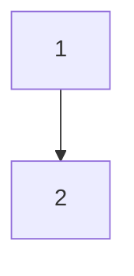
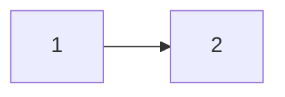
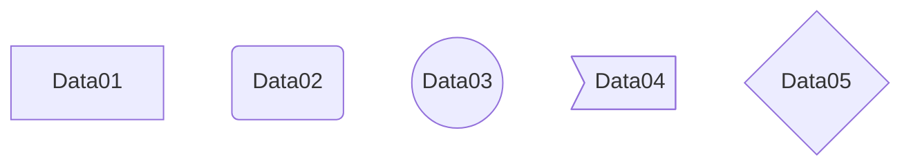
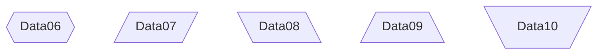
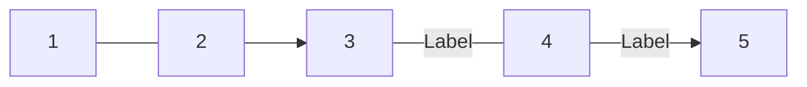
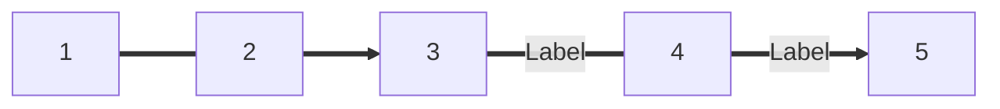
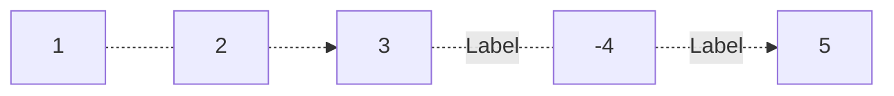
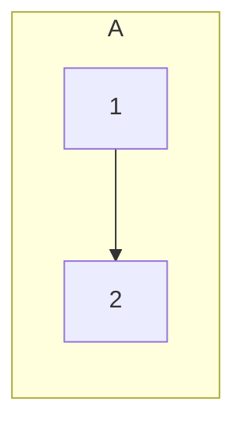
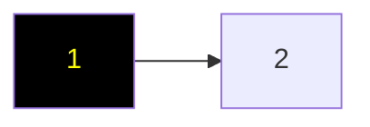

```mermaid
graph TD
1 --> 2
```

```mermaid
graph LR
1 --> 2
```

```mermaid
graph TD
ID01[Data01]
ID02(Data02)
ID03((Data03))
ID04>Data04]
ID05{Data05}
```

```mermaid
graph TD
ID06{{Data06}}
ID07[/Data07/]
ID08[\Data08\]
ID09[/Data09\]
ID10[\Data10/]
```

```mermaid
graph LR
1---2-->3--Label---4--Label-->5
```

```mermaid
graph LR
1===2==>3==Label===4==Label==>5
```

```mermaid
graph LR
1-.-2-.->3-.Label.--4-.Label.->5
```

```mermaid
graph LR
subgraph A
1-->2
end
```

```mermaid
graph LR
1-->2
style 1 color:yellow,fill:black
```
